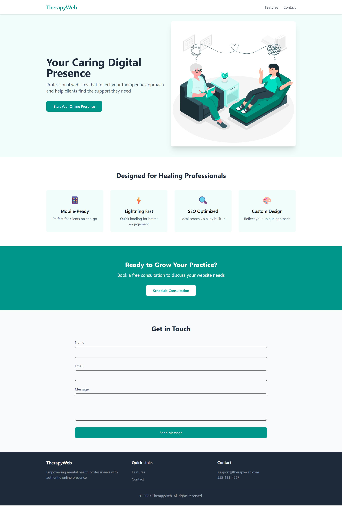
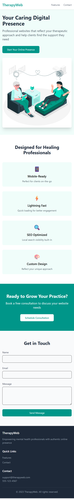

# TherapyWeb

A professional website template designed specifically for mental health professionals and psychotherapists. Built with React, Vite, and TailwindCSS.



## Features

- 📱 Fully responsive design
- ⚡ Lightning-fast performance with Vite
- 🎨 Modern, clean UI with TailwindCSS
- 🔍 SEO-optimized structure
- 📝 Contact form integration
- 🖼 Professional imagery and layout

## Responsive Design



## Tech Stack

- React
- Vite
- TailwindCSS
- ESLint

## Getting Started

1. Clone the repository:

```bash
git clone <repository-url>
```

2. Install dependencies:

```bash
npm install
```

3. Run development server:

```bash
npm run dev
```

4. Build for production:

```bash
npm run build
```

## Project Structure

```
src/
├── components/
│   ├── Header.jsx
│   ├── Hero.jsx
│   ├── Features.jsx
│   ├── Cta.jsx
│   ├── Contact.jsx
│   └── Footer.jsx
├── App.jsx
├── main.jsx
└── index.css
```

## License

MIT

